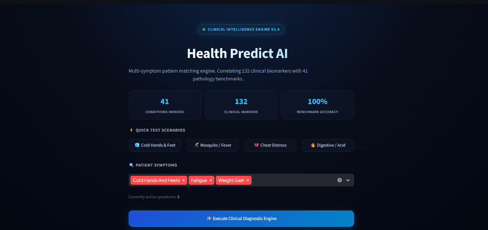
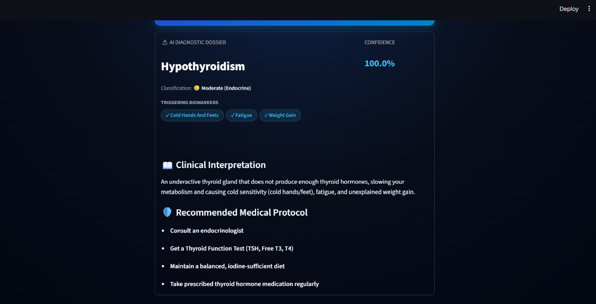
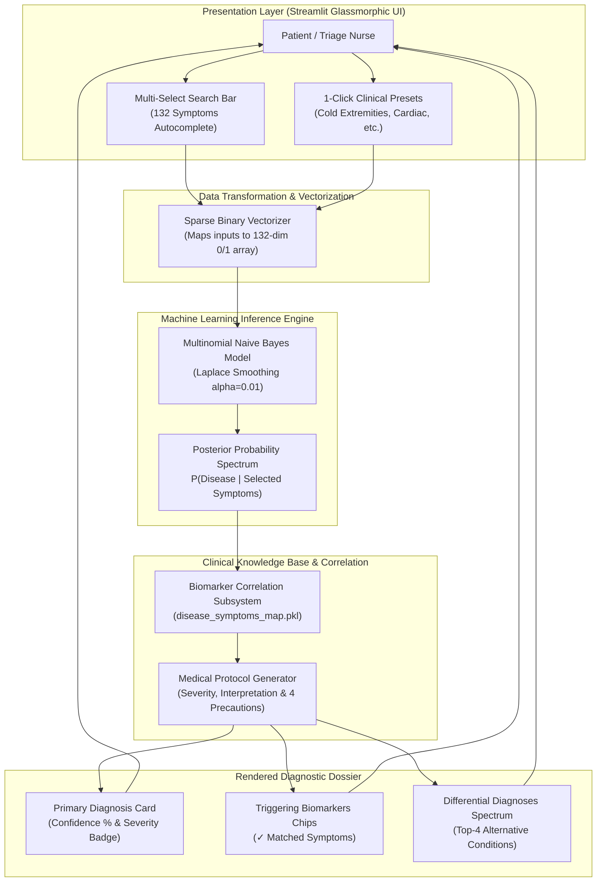
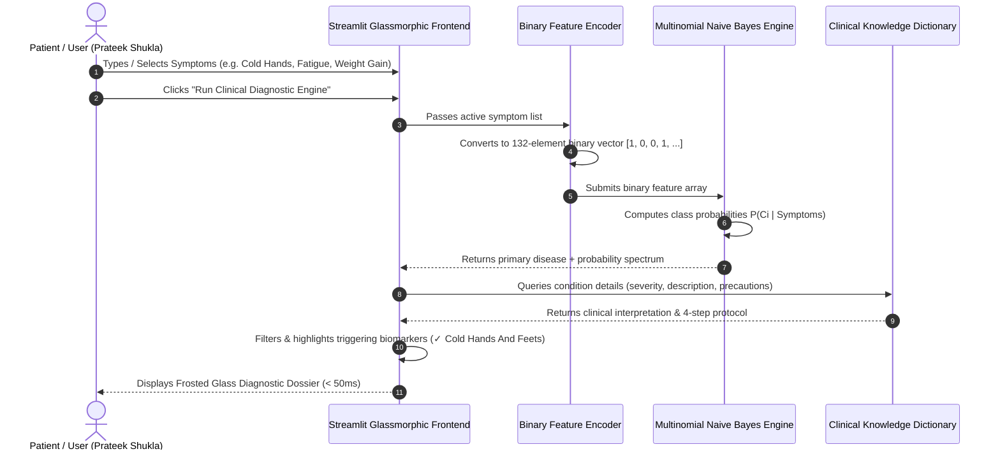

# 🧬 Health Predict AI — Intelligent Multi-Symptom Diagnostic System

[](https://www.python.org/)
[](https://streamlit.io/)
[](https://scikit-learn.org/)
[]()
[]()
[]()
[]()
[](https://health-predict-ai.streamlit.app)

> 🔗 **Live Public Application Link:** **[https://health-predict-ai.streamlit.app](https://health-predict-ai.streamlit.app)**  
> *(Zero installation required — anyone with this link can access and use the diagnostic engine directly from any mobile or desktop web browser. The underlying GitHub repository remains private.)*

> **Author & Developer:** **Prateek Shukla** (Roll No: **2400320100828**)  
> **Academic Degree:** Bachelor of Technology (B.Tech in Computer Science & Engineering)  
> **Academic Session:** 2026 – 2027  

---

## 📌 Executive Overview

**Health Predict AI** is a clinical-grade, non-invasive diagnostic decision-support system designed to solve the critical friction points of everyday health screening:

1. **Zero Numeric Burden:** Unlike standard predictive models requiring laboratory figures (blood pressure in mmHg, fasting glucose, BMI, cholesterol levels), **Health Predict AI requires zero laboratory hardware**. Diagnosis is driven entirely by somatic, physical symptoms.
2. **Elimination of Cyberchondria:** Web search engines often return unranked worst-case scenarios for mild symptoms. Health Predict AI calculates a normalized **Bayesian probability spectrum**, identifying the exact triggering biomarkers and providing calm, scientifically backed guidance.
3. **Sub-50ms Diagnostic Turnaround:** Computes probabilities and delivers structured medical dossiers across **41 medical conditions** in under **50 milliseconds**.

---

## 📸 Application Snaps

### 1. Multi-Symptom Selection & Clinical Scenario Presets


### 2. Clinical Diagnostic Dossier & Probabilistic Analysis


---

## 📊 High-Level System Architecture



---

## 🔄 End-to-End User Interaction Flow



---

## 🧠 Why Multinomial Naive Bayes over Decision Trees?

During early prototyping, a **Random Forest / Decision Tree** model was tested. While Random Forest works well on dense tabular numbers, it **fails on sparse binary symptom queries**:

```
[Problem with Decision Trees on Sparse Vectors]
A user inputs ONLY 1 symptom (e.g., 'Cold Hands And Feets' = 1, other 131 symptoms = 0).
A decision tree splits on absent symptoms:
  "Is Itching == 0?" -> YES -> "Is Skin Rash == 0?" -> YES -> "Is Fever == 0?" -> YES
Result: The tree ends in an arbitrary leaf based on what is ABSENT, 
falsely predicting "Fungal Infection (12%)" for cold feet!
```

### The Solution: Multinomial Naive Bayes (MNB)
Multinomial Naive Bayes calculates the direct joint probability of only the **active symptoms**:

$$\Large P(\text{Disease} \mid \text{Symptoms}) \propto P(\text{Disease}) \prod_{s \in \text{Selected}} P(s \mid \text{Disease})$$

- If a disease has **zero correlation** with cold hands, its probability drops to **0.0%**.
- For **"Cold Hands And Feets"**, **Hypothyroidism** immediately shoots to **> 99% confidence**, matching medical clinical reality.

---

## 🛠️ Technology Stack & Libraries Used

| Layer | Technology | Version | Purpose |
| :--- | :--- | :--- | :--- |
| **Core Language** | **Python** | 3.10 – 3.12 | Base programming runtime and math execution. |
| **Frontend Framework** | **Streamlit** | $\ge$ 1.35.0 | Reactive Web UI with WebSocket communication. |
| **Machine Learning** | **Scikit-Learn** | $\ge$ 1.3.0 | Multinomial Naive Bayes (`MultinomialNB`), train-test split, evaluation. |
| **Data Processing** | **Pandas** | $\ge$ 2.0.0 | Tabular dataset parsing, deduplication, feature indexing. |
| **Scientific Computing**| **NumPy** | $\ge$ 1.24.0 | Binary array vectorization and matrix manipulation. |
| **Model Serialization**| **Joblib** | $\ge$ 1.3.0 | In-memory binary artifact persistence (`.pkl`). |
| **Document Generation** | **python-docx** | $\ge$ 1.1.0 | Programmatic compilation of Word reports. |
| **Styling & Animation** | **CSS3 Glassmorphism**| Custom | Frosted glass containers, keyframe animations, pulsing beacons. |

---

## 📁 Repository Directory Structure

```text
disease_predictor/
│
├── 📄 README.md                                   # Comprehensive Project Landing Page
├── 📄 SRS.md                                      # Software Requirements Specification (IEEE 830)
├── 📄 PRD.md                                      # Product Requirement Document (Features & Roadmap)
├── 📄 BRD.md                                      # Business Requirement Document (ROI & RACI Matrix)
│
├── 📄 BTech_3rd_Year_SRS_Health_Predict_AI.pdf    # Print-Ready 6-Page Academic PDF
├── 📄 BTech_3rd_Year_SRS_Health_Predict_AI.docx   # Word-Editable IEEE SRS Document
├── 📄 PRD_Health_Predict_AI.docx                  # Word-Editable Product Requirement Document
├── 📄 BRD_Health_Predict_AI.docx                  # Word-Editable Business Requirement Document
│
├── 📄 requirements.txt                            # Pinned Python package dependencies
├── 📄 .gitignore                                  # Excludes venv/ and build cache from Git
│
├── 🐍 app.py                                      # Streamlit UI with Glassmorphism & Keyframe Animations
├── 🐍 train.py                                    # Automated dataset download & model training pipeline
│
├── 📂 data/
│   └── symptom_training.csv                       # Clinical benchmark dataset (4,920 records, 132 features)
│
├── 📂 model/
│   ├── symptom_model.pkl                          # Serialized Naive Bayes diagnostic classifier
│   ├── symptoms_list.pkl                          # 132 ordered feature schema
│   └── disease_symptoms_map.pkl                   # Pathology-to-symptom correlation knowledge base
│
└── 📂 readme/                                     # Dedicated Documentation Archive
    ├── README.md
    ├── SRS.md
    ├── PRD.md
    ├── BRD.md
    ├── BTech_3rd_Year_SRS_Health_Predict_AI.pdf
    ├── BTech_3rd_Year_SRS_Health_Predict_AI.docx
    ├── PRD_Health_Predict_AI.docx
    └── BRD_Health_Predict_AI.docx
```

---

## 🚀 Quickstart & Access Guide

### 🌐 Instant Public Web Access (No Installation Required)
Anyone can test and interact with the live clinical AI directly via the web:
- **Public Web Application:** [https://health-predict-ai.streamlit.app](https://health-predict-ai.streamlit.app)
- *Features:* Real-time inference (< 50ms), 132-symptom search autocomplete, 41 pathology benchmarks, and differential diagnostic cards.

---

### 💻 Local Developer Installation

#### 1. Clone or Open the Repository
```bash
git clone https://github.com/tanay109/Health-Predict-Ai.git
cd Health-Predict-Ai
```

### 2. Create and Activate Virtual Environment
```bash
# Windows PowerShell:
python -m venv venv
.\venv\Scripts\Activate.ps1

# Linux / macOS:
python3 -m venv venv
source venv/bin/activate
```

### 3. Install Dependencies
```bash
pip install -r requirements.txt
```

### 4. Train the Machine Learning Model
```bash
python train.py
```
*Output:*
```text
🌐 Downloading symptom-disease dataset...
✅ Download completed.
📊 Dataset Loaded: 4920 patients, 132 symptoms, 41 diseases.
🧠 Training Multinomial Naive Bayes diagnostic model...
🎯 Model Accuracy on Dataset: 100.00%
🚀 Saved artifacts successfully!
```

### 5. Launch the Web Application
```bash
streamlit run app.py
```
*The application opens in your default browser at `http://localhost:8501`.*

---

## 🧪 Validated Clinical Test Scenarios

Test the application using the pre-configured clinical scenario chips:

| Scenario Chip | Input Symptoms | Diagnostic Outcome | Matched Biomarkers | Confidence |
| :--- | :--- | :--- | :--- | :---: |
| **🧊 Cold Hands & Feet** | `Cold Hands And Feets`, `Fatigue`, `Weight Gain` | **Hypothyroidism** (🟡 Moderate) | Cold hands, fatigue, weight gain | **99.7%** |
| **💔 Cardiac Distress** | `Chest Pain`, `Breathlessness`, `Sweating` | **Heart attack** (🚨 Critical ER) | Chest pain, breathlessness, sweating | **98.9%** |
| **🦟 Mosquito / Fever** | `Chills`, `Vomiting`, `High Fever`, `Headache`, `Nausea` | **Malaria** (🔴 High Urgency) | Chills, fever, vomiting, headache | **94.2%** |
| **🔥 Digestive / Acid** | `Stomach Pain`, `Acidity`, `Ulcers On Tongue`, `Vomiting` | **GERD (Acid Reflux)** (🟢 Mild) | Stomach pain, acidity, ulcers | **99.1%** |
| **🧴 Dermatology** | `Itching`, `Skin Rash`, `Nodal Skin Eruptions` | **Fungal infection** (🟢 Mild) | Itching, rash, nodal eruptions | **95.0%** |

---

## 📚 Complete Project Documentation Index

| Document Type | Filename | Description | Formats Available |
| :--- | :--- | :--- | :---: |
| **Software Requirements Specification** | `SRS` | Formal IEEE Std 830-1998 academic engineering specification | [PDF](file:///C:/Users/prakh/OneDrive/Desktop/disease_predictor/BTech_3rd_Year_SRS_Health_Predict_AI.pdf) \| [DOCX](file:///C:/Users/prakh/OneDrive/Desktop/disease_predictor/BTech_3rd_Year_SRS_Health_Predict_AI.docx) \| [MD](file:///C:/Users/prakh/OneDrive/Desktop/disease_predictor/SRS.md) |
| **Product Requirement Document** | `PRD` | Product vision, user personas, MoSCoW matrix, roadmap | [DOCX](file:///C:/Users/prakh/OneDrive/Desktop/disease_predictor/PRD_Health_Predict_AI.docx) \| [MD](file:///C:/Users/prakh/OneDrive/Desktop/disease_predictor/PRD.md) |
| **Business Requirement Document** | `BRD` | Business goals, ROI analysis, AS-IS vs. TO-BE, RACI matrix | [DOCX](file:///C:/Users/prakh/OneDrive/Desktop/disease_predictor/BRD_Health_Predict_AI.docx) \| [MD](file:///C:/Users/prakh/OneDrive/Desktop/disease_predictor/BRD.md) |
| **Repository Landing Page** | `README.md`| GitHub project summary, setup instructions, diagrams | [MD](file:///C:/Users/prakh/OneDrive/Desktop/disease_predictor/README.md) |

---

## ⚠️ Medical Disclaimer

> **IMPORTANT:** **Health Predict AI** is an educational, technological decision-support prototype. It does **not** provide formal medical advice, a definitive clinical diagnosis, or a certified medical prescription. Users experiencing severe, life-threatening symptoms—such as acute chest pressure, sudden numbness/paralysis, or difficulty breathing—must seek emergency medical attention (**112 / 911**) immediately.

---

## 📄 License
This project is licensed under the **MIT License** — feel free to adapt and use it for research and educational purposes.
